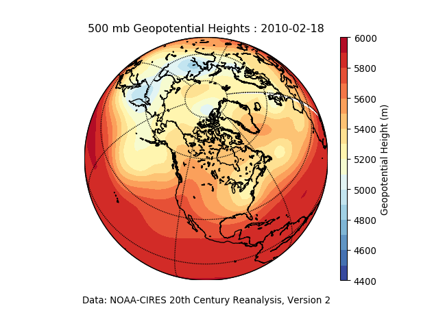

# Level Up! Your Scientific Coding

Slides and example code used in the "Level Up! Your Scientific Coding" webinars.

The example code is old, using Python 2.7.
One way to run this code is in an isolated environment.
For example,
if you have [Anaconda](https://www.anaconda.com/distribution/) installed,
create an environment with the file provided in this repo:

    conda env create --file=environment.yaml

Activate the environment:

    source activate lvlup

Then run the example:

    python nc20reanalysis.py

The result is a file, "gph.png",
that should look like this:

